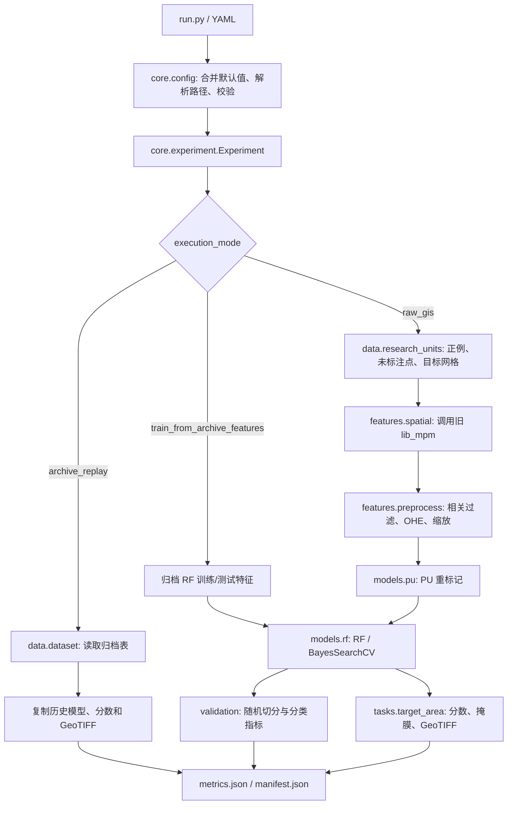

# MPM_codex 代码结构、审查与找矿预测研究适配性报告

## 1. 审查结论

`MPM_codex` 已经具备一个清晰的第一阶段实验框架：配置、数据访问、研究单元、空间特征、预处理、PU/RF 模型、验证、二维目标区制图和运行清单被拆成独立模块；两套历史归档（Lachlan 与 NSW）也有文件级契约。它适合作为：

- 旧 Notebook 工作流的行为基线与产物回放器；
- 二维斑岩铜矿远景预测的工程重构起点；
- 基于既有 138 维特征表开展 RF/PU 方法原型试验的起点。

但它**目前不适合直接作为可信、可发表或可用于勘查决策的新找矿预测研究平台**，也不能支持深部/三维预测。核心原因不是代码目录结构，而是：`raw_gis` 链路存在阻断性实现错误；测试和配置依赖固定外部目录；随机点级验证与普通 CV 存在空间泄漏；未标注点被当作负类评价；预处理在切分前观察数据；目标区重新拟合缩放器；输出又按目标区 MinMax，因而 `prob` 不是可校准或可跨区比较的成矿概率。

### 适用性分级

| 使用场景 | 当前适用性 | 判断 |
|---|---:|---|
| 历史归档产物回放 | 较高 | 临时修正本机数据路径后，归档回放烟雾测试通过，保持 138 个特征并生成 13 个运行产物 |
| 历史特征表上的 RF 重训 | 有条件可用 | 代码链存在，但需要兼容版本的 scikit-learn、scikit-optimize，并应先修复验证方法 |
| 从原始 GIS 到新预测图 | 当前不可用 | `raw_gis` 目标掩膜处理存在 DataFrame/NumPy 索引错误，且环境与路径尚未形成可移植契约 |
| 严谨二维找矿预测研究 | 尚不满足 | 空间验证、PU 评价、泄漏控制、概率语义、外部验证和不确定性不足 |
| 深部/三维/钻孔约束预测 | 不支持 | 代码明确拒绝 `deep_edge_prediction`，没有体素、深度标签、钻孔区间或三维模型 |

## 2. 审查范围与证据

- 审查目录：`D:/Deep_Mining/MPM/MPM_codex`。
- Python 文件：28 个，全部可被 AST 解析且已有模块级 docstring。
- 类：15 个；补充前 8 个有 docstring、7 个缺失，补充后 15/15。
- 函数/方法（包括私有函数、测试方法和嵌套函数）：99 个；补充前 26 个有 docstring、73 个缺失，补充后 99/99。
- 注释修改涉及 16 个 `.py` 文件；没有改动函数签名、表达式、控制流、模型参数、配置或数据格式。
- 对全部 28 个 `.py` 文件分别移除 docstring 后计算 AST 指纹；修改前后 28/28 一致，说明可执行语法树未变化。
- `python -m compileall -q .`：通过。
- 归档回放烟雾测试：通过；Lachlan 归档得到 138 个特征和 13 个登记产物。
- 现有测试：共发现 12 项，7 项通过；5 项失败均可由修改前已经存在的路径/外部数据问题复现，详见第 9 节。

归档清单记录 71 个输入栅格、22 个 Shapefile，以及两个正式契约输出集。实际正式归档的主要规模如下：

| 数据 | Lachlan | NSW |
|---|---:|---:|
| 正例原始表 | 277 × 806 | 277 × 806 |
| 未标注原始表 | 272 × 806 | 272 × 806 |
| `Xy_train.csv` | 479 × 140（207 正例、272 未标注零类） | 同左 |
| RF 训练表 | 359 × 140 | 359 × 140 |
| RF 测试表 | 120 × 140 | 120 × 140 |
| 目标特征 | 4,071 × 138 | 7,583 × 138 |
| 目标分数 | 4,071 × 4 | 7,583 × 4 |
| 目标掩膜 | 4,200 × 3 | 11,938 × 3 |

两个区域的保存分数都严格落在 `[0, 1]`，这是目标区 MinMax 的必然结果，不能据此认定模型已做概率校准。

## 3. 总体目录结构

```text
MPM_codex/
├── baseline_tools.py                    # 安全读取历史 CSV/TIFF/pickle 元数据
├── run.py                               # 单实验命令入口
├── scripts/
│   └── create_baseline_manifest.py      # 生成重构前只读基线清单
├── src/
│   ├── __init__.py
│   ├── core/
│   │   ├── __init__.py
│   │   ├── config.py                    # YAML 默认值、路径解析与校验
│   │   └── experiment.py                # 全流程编排与运行清单
│   ├── data/
│   │   ├── __init__.py
│   │   ├── dataset.py                   # 归档特征表读取与 schema 校验
│   │   ├── labels.py                    # 正例/未标注标签与样本权重
│   │   └── research_units.py            # 点研究单元、随机点、预测网格
│   ├── features/
│   │   ├── __init__.py
│   │   ├── preprocess.py                # 相关过滤、OHE、缩放、正例留出
│   │   └── spatial.py                   # 旧 lib_mpm 空间算子的适配层
│   ├── models/
│   │   ├── __init__.py
│   │   ├── pu.py                        # Bagging PU 与重标记
│   │   └── rf.py                        # RF 构造、训练和贝叶斯搜索
│   ├── tasks/
│   │   ├── __init__.py
│   │   └── target_area.py               # 二维评分、网格恢复与 GeoTIFF
│   ├── utils/
│   │   ├── __init__.py
│   │   └── files.py                     # 时间、哈希、JSON/YAML、Git 信息
│   └── validation/
│       ├── __init__.py
│       ├── metrics.py                   # 分类指标
│       └── splitters.py                 # 随机点级切分
└── tests/
    ├── __init__.py
    ├── test_framework.py                # 框架烟雾与回放测试
    └── baseline/
        ├── __init__.py
        └── test_baseline_artifacts.py   # 历史产物契约测试
```

配置、文档和产物虽不是 Python 文件，但也是运行架构的一部分：

- `configs/experiments/*.yaml`：Lachlan/NSW 的实验、数据、特征、模型和验证参数。
- `docs/baseline_manifest.json`：重构前数据与产物元数据契约。
- `outputs/<experiment>/`：解析后配置、中间表、模型、指标、预测图和 manifest。
- `legacy/`：旧代码说明，不参与新框架导入。

## 4. 主执行链与模块依赖



### 三种执行模式

1. `archive_replay`：读取归档表并复制既有 RF pickle、`target_probs.csv` 和 GeoTIFF；不加载模型、不重新推理、不重新计算指标。
2. `train_from_archive_features`：使用保存的 `Xy_rf_train.csv`/`Xy_rf_test.csv` 重训 RF，再对保存的目标特征推理。
3. `raw_gis`：从 occurrence、边界、地质矢量和栅格重新构建全部特征，再执行 PU、RF 和制图；这是研究最需要的模式，但当前有阻断性错误且没有通过端到端测试。

### 关键依赖

- 通用：Python、PyYAML、NumPy、pandas、scikit-learn。
- GIS：GeoPandas、Shapely、GDAL Python bindings。
- 旧空间实现：外部仓库 `lib_mpm.py` 及其 rasterio/scikit-image 等依赖。
- 搜索与 PU：scikit-optimize、pulearn。
- 产物：CSV、pickle、GeoTIFF；pickle 具有版本兼容和不可信反序列化风险，当前回放模式选择只复制、不加载是合理的安全边界。

## 5. 逐个 Python 文件说明

### 5.1 根目录与命令脚本

#### `baseline_tools.py`

职责：在不导入旧项目、不反序列化 pickle、也不依赖 pandas/GDAL 的情况下审计基线产物。

- `sha256_file`：分块计算文件 SHA-256。
- `schema_digest`：对有序列名生成稳定 schema 哈希。
- `csv_metadata`：读取 CSV 列、行数、标签分布和特征数。
- `_prepend`：把已消费的首行放回迭代序列，服务无表头 CSV。
- `_read_at`：从二进制句柄指定偏移精确读取字节。
- `_unpack_values`：解析 classic TIFF/BigTIFF 字段值。
- `tiff_metadata`：不借助 GDAL 读取首幅 TIFF 的 shape、band、dtype、像元比例等元数据。
- 内部 `scalar`：取 TIFF tag 的首值或默认值。
- `pickle_model_type`：仅搜索字节标记判断已知模型/转换器类型，不执行 pickle。
- `artifact_metadata`：按扩展名分派 CSV、TIFF、pickle 或普通文件元数据读取。

#### `run.py`

职责：框架的命令行入口。`main` 解析 `--config`，调用 `load_config` 与 `Experiment.run`，把配置、文件、运行时和能力错误转换为 argparse 错误，并以整数状态退出。

#### `scripts/create_baseline_manifest.py`

职责：只读扫描旧仓库，生成 `docs/baseline_manifest.json`。

- `relative`：生成 POSIX 风格相对路径。
- `source_files`：记录 Notebook、`lib_mpm.py`、环境文件和模型比较脚本的大小与哈希。
- `raster_inventory`：扫描非输出 TIFF，并容错记录元数据读取错误。
- `vector_inventory`：记录 Shapefile 路径与大小。
- `output_artifacts`：遍历四种已知输出目录并安全提取产物元数据。
- `count_by_parent`：按相对路径第一层目录聚合计数。
- `main`：解析旧仓库与输出路径，构造并写入完整 JSON 清单。

### 5.2 `src` 主包

#### `src/__init__.py`

包标记；说明该包是 MPM 重构后的最小实验框架，没有类或函数。

#### `src/core/__init__.py`

核心配置和编排子包标记，没有可执行定义。

#### `src/core/config.py`

职责：配置默认值、递归合并、路径解析与能力边界校验。

- `ConfigError`：配置不完整或非法时的异常。
- `_deep_merge`：深拷贝并递归覆盖默认配置。
- `_require`：按点分隔路径读取必填非空配置。
- `_resolve_path`：把相对路径解析到约定的 `MPM_codex` 根。
- `_resolve_dataset_paths`：原地解析数据、地质列表和输出目录路径。
- `ExperimentConfig`：冻结的解析后配置；`output_dir`、`name`、`section` 提供常用访问接口。
- `validate_config`：限制当前阶段允许的模式、任务、研究单元、预处理、模型、验证和输出语义。
- `load_config`：读取 YAML、合并默认值、解析路径、校验并返回 `ExperimentConfig`。

#### `src/core/experiment.py`

职责：用一个显式类串联全部实验阶段。

- `Experiment.__init__`：保存状态、创建任务和运行目录，并立即写解析后配置。
- `mode`：返回执行模式。
- `_prepare_output_layout`：创建 models/intermediate/predictions/figures 等目录。
- `prepare_data`：读取归档数据，或在 raw GIS 模式构造正例点。
- `build_features`：复制归档表，或提取正例、未标注与目标区空间特征。
- `prepare_dataset`：校验归档 schema，或执行 raw GIS 预处理和目标掩膜同步。
- `train`：复制历史 RF，或执行 PU 重标记后训练 RF。
- `evaluate`：写入回放说明或重算分类指标。
- `predict`：复制历史预测，或计算新分数并导出 GeoTIFF。
- `export`：写包含配置、输入、特征 schema、模型和产物列表的 manifest。
- `_input_paths`：递归生成输入路径存在性与文件哈希；内部 `describe` 处理字符串、列表和字典。
- `run`：按 data → features → dataset → train → evaluate → predict → export 执行。

#### `src/data/__init__.py`

数据、标签和研究单元子包标记，没有可执行定义。

#### `src/data/dataset.py`

职责：只读加载已保存的基线特征表。

- `ArchiveDataset`：保存训练、重标记、RF 切分、目标特征、坐标、掩膜和源文件路径。
- `feature_columns`：剔除 `sample_weight` 与 `label` 后返回特征顺序。
- `validate_schema`：校验各训练表列顺序，以及目标特征和坐标行数。
- `summary`：生成可序列化的 shape、标签和 schema 摘要。
- `DatasetRepository.__init__`：绑定配置中的归档目录。
- `load_archive`：检查七个必需 CSV，读取并校验为 `ArchiveDataset`。
- `snapshot`：把本次消费的特征表精确复制到运行目录。

#### `src/data/labels.py`

职责：显式保存当前标签与样本权重假设。

- `positive_labels_from_size_code`：把 occurrence 的 `SIZE_CODE` 映射为正类和权重，缺失映射时报错。
- `unlabeled_labels`：把随机点硬编码为配置的未标注零类及统一权重；docstring 已明确它们不是 verified barren。

#### `src/data/research_units.py`

职责：构造二维点局部环境研究单元。

- `load_vector`：延迟导入 GeoPandas 并读取矢量。
- `build_positive_units`：把矿点 geometry 转为 `X/Y/label/sample_weight`。
- `sample_unlabeled_units`：在边界包围盒内生成候选点，保留落在首个 polygon 内的点。
- `build_prediction_grid`：按经纬度步长创建规则网格，返回 polygon 内点及完整布尔掩膜。

#### `src/features/__init__.py`

空间特征与预处理子包标记，没有可执行定义。

#### `src/features/preprocess.py`

职责：复刻 Notebook 的相关筛选、独热编码、标准化和正例留出。

- `split_feature_columns`：按列名前缀识别侵入体、变质相和岩性类别，其余候选作为数值特征。
- `PreparedTrainingData`：保存训练表、正例留出表、缩放前表和最终特征列。
- `BaselinePreprocessor.__init__`：创建 `OneHotEncoder`、`StandardScaler` 与拟合状态。
- `prepare_training`：合并正例和未标注点，在全表做 Spearman 过滤/OHE，再留出 25% 正例并缩放训练数值列。
- `transform_target_legacy`：为兼容旧 Notebook，在目标区重新 `fit_transform` 数值特征，再应用训练类别编码器。

#### `src/features/spatial.py`

职责：把外部旧 `lib_mpm` 空间算子接入新框架，本文件不重写 GIS 算法。

- `SpatialFeatureExtractor.__init__`：保存数据路径和特征开关。
- `_operators`：把外部根插入 `sys.path`，延迟导入并缓存 `lib_mpm`。
- `line_distances`：调用 `get_dist_line` 提取地质/地震线的 geodesic 距离。
- `categorical`：调用 `get_cat_data` 提取变质相、侵入体和岩性类别。
- `raster_features`：按开关调用窗口统计、GLCM 纹理和 DEM 梯度算子。
- `extract`：按 Notebook 顺序拼接研究单元、栅格、线距离和类别特征。
- `_raster_files`：从四类配置目录收集排序后的顶层 `.tif`。

#### `src/models/__init__.py`

模型适配器子包标记，没有可执行定义。

#### `src/models/pu.py`

职责：旧 Bagging PU 阶段。

- `train_and_relabel`：延迟导入 `pulearn` 与 `skopt`，以 RF 为基学习器做贝叶斯搜索；对训练集原位预测并重标记，同时强制所有原正例仍为正类。

#### `src/models/rf.py`

职责：RF 基线模型构造与训练。

- `ModelCapabilityError`：旧可选依赖不可用时的异常。
- `build_rf`：构造 RF，未配置时补 `n_jobs=-1` 和给定 seed。
- `train_rf`：关闭搜索时直接拟合；开启时用 `BayesSearchCV` 搜索六类 RF 超参数并返回最佳估计器。

#### `src/tasks/__init__.py`

预测任务子包标记，没有可执行定义。

#### `src/tasks/target_area.py`

职责：当前唯一实现的二维目标区任务。

- `TaskCapabilityError`：请求不可用任务或缺少 GDAL 时的能力异常。
- `TargetAreaPredictionTask.__init__`：保存分数和导出配置。
- `predict`：取得正类 `predict_proba`；按配置对整个目标区 MinMax，并返回 `X/Y/prob`。
- `reconstruct_grid`：按 target mask 把有效分数填回完整矩形网格。
- `export_geotiff`：用 GDAL 写 EPSG:4283、float32、单波段 GeoTIFF。
- `create_task`：创建二维任务；对 deep-edge 给出缺失 3D 数据/实现的明确错误。

#### `src/utils/__init__.py`

共享小工具子包标记，没有可执行定义。

#### `src/utils/files.py`

职责：不含实验政策的文件辅助函数。

- `utc_timestamp`：UTC 秒级时间。
- `sha256_file`：分块文件哈希。
- `write_json`：创建父目录并写格式化 JSON。
- `write_yaml`：创建父目录并写保序 YAML。
- `git_commit`：若指定数据根是 Git worktree，读取 HEAD；否则返回 `None`。

#### `src/validation/__init__.py`

验证指标与切分策略子包标记，没有可执行定义。

#### `src/validation/metrics.py`

职责：报告旧 Notebook/模型比较使用的指标。

- `evaluate_classifier`：计算加权 accuracy/precision/recall/F1、未加权 confusion matrix、行数，以及双类情况下的加权 ROC AUC。

#### `src/validation/splitters.py`

职责：显式封装当前非空间随机切分。

- `SplitData`：保存特征、标签和样本权重的训练/测试分区。
- `random_split`：使用固定 seed 的 `train_test_split`；代码警告空间泄漏仍可能存在。

### 5.3 测试包

#### `tests/__init__.py`

阶段 1 框架测试包标记，没有可执行定义。

#### `tests/baseline/__init__.py`

重构前持久化产物契约测试包标记，没有可执行定义。

#### `tests/baseline/test_baseline_artifacts.py`

职责：不训练模型，仅把实际旧产物与 `baseline_manifest.json` 比较。

- `BaselineArtifactTests`：契约测试集合。
- `setUpClass`：加载 manifest 和 `MPM_BASELINE_SOURCE_ROOT/Datasets`。
- `expected`：取某产物的预期元数据。
- `actual_path`：断言实际产物存在。
- `assert_csv_contract`：比较列数、行数、schema 哈希、标签分布和特征数。
- 五个测试分别约束 CSV、目标/训练 schema、PUB/RF 标签、GeoTIFF shape，以及非正式 `Outputs_test` 快照的不一致性。

#### `tests/test_framework.py`

职责：配置、研究单元、空间适配器、RF、归档回放与能力错误的烟雾测试。

- `FakeLegacyOperators`：五个方法分别模拟线距离、类别、窗口统计、纹理和梯度输出，并检查调用参数。
- `FrameworkTests.test_config_load`：检查配置名称、任务、网格和外部路径。
- `test_config_validation`：检查非法 buffer/task。
- `test_research_unit_smoke`：读取实际 occurrence/边界并检查研究单元。
- `test_feature_extraction_smoke`：注入假算子并检查合并特征。
- `test_rf_model_smoke`：在合成数据上训练直接 RF 并检查指标。
- `test_end_to_end_small_archive_replay_and_baseline_schema`：临时目录回放并核对 schema、行数和预测哈希。
- `test_deep_edge_task_is_explicitly_unavailable`：确认深部任务明确失败。

## 6. 代码审查发现

### 6.1 阻断性与高优先级问题

| 级别 | 发现 | 代码证据 | 影响与建议 |
|---|---|---|---|
| P0 | `raw_gis` 目标掩膜必然触发错误 | `src/core/experiment.py:104-108` 先保存/复制 pandas DataFrame，随后用 `target_mask[:, 2]` 和二维 NumPy 赋值 | 当前原始 GIS 端到端模式不可运行。统一为 NumPy 数组，或用 `.iloc`/`.loc`，并增加 raw GIS 小样本端到端测试 |
| P0 | 当前验证不能支撑空间泛化结论 | `src/validation/splitters.py:34-35` 是随机点切分；YAML 固定 `split: random, cv: 10` | 相邻点/同一成矿系统可跨训练测试，指标偏乐观。采用空间 block CV、矿床簇分组、leave-region-out，并保留独立空间测试区 |
| P0 | 未标注点被当作负类计算监督指标 | `src/data/labels.py:34-35` 把随机点编码为 0；`metrics.py:15-23` 按二分类计算指标 | 0 类并非 verified barren，confusion matrix、precision、ROC AUC 的科学语义不成立。使用 PU 风险估计、可靠负类/勘查验证集，并报告正例发现率与面积占比 |
| P0 | 预处理观察了后续验证数据 | `features/preprocess.py:66-87` 在正例留出和 RF 切分前做相关筛选/OHE；RF 切分更晚发生 | 特征选择和编码泄漏，且 RF 测试样本参与 scaler 拟合。把全部预处理封装进 sklearn Pipeline，并只在每个训练 fold 内拟合 |
| P0 | 目标特征被重新拟合标准化 | `features/preprocess.py:130` 对目标区 `scaler.fit_transform` | 训练与预测不在同一特征变换坐标系。新版本实验应只使用训练 scaler 的 `transform`，并作为有版本的科学变更与基线并行 |
| P0 | 输出 `prob` 不是概率 | `tasks/target_area.py:33-40` 对全目标区概率再次 MinMax | 每幅图强制含 0/1，跨区、跨模型、跨时间不可比较，也不能按概率阈值决策。保留原始 `predict_proba`，需要概率时在独立验证集做校准；相对分数应改名 `prospectivity_score` |

### 6.2 工程与实现问题

| 级别 | 发现 | 证据与影响 |
|---|---|---|
| P1 | 配置路径不可移植 | 两套 YAML 指向 `../EarthByte-MPM_Lachlan_Porphyry`，本机实际目录为带 `-aafce81` 后缀的目录；测试因此有 4 项路径相关失败。应允许 CLI/env 数据根覆盖，避免修改实验语义配置 |
| P1 | 未标注抽样不确定且可能不足 | `research_units.py:47-60` 使用全局未设种子的 NumPy RNG，只生成 `count*2` 个候选且不保证接受数达到 `count`。应使用显式 `Generator(seed)` 并循环至满足数量或明确失败 |
| P1 | 只使用边界文件第一条 geometry | `research_units.py:45,69` 使用 `geometry.iloc[0]` | 多要素边界会被静默忽略。应 dissolve/union 全部有效 geometry，并校验 CRS、空几何和范围 |
| P1 | `model.name` 被校验但未用于选择训练器 | `config.py:167-168` 允许 `rf/pu`；`experiment.py:157` 最终始终调用 `train_rf`，PU 只是前置重标记开关 | 配置语义容易误导。应把 `model.name` 定义为最终估计器，或删除无效选项并把 PU 明确命名为 label refinement stage |
| P1 | 归档回放不是计算复现 | `archive_replay` 复制 pickle/CSV/TIFF，指标标记 `recomputed: false` | 它能证明文件复制与 schema 契约，不证明当前代码能从原始 GIS 复现相同模型和图。报告中必须称“artifact replay”，不能称“完整复现实验” |
| P1 | 回放指标 JSON 内部字段不一致 | `experiment.py:183-185` 的 `train_rows=359`，但 `train_label_distribution` 取自 479 行的 `xy_train`；实际输出分布和为 479 | 下游会误读训练分布。应分别记录 `xy_train`、`xy_rf_train` 和 `xy_rf_test` 的行数/标签，并加一致性测试 |
| P1 | 正例留出集没有进入框架评价 | `PreparedTrainingData` 生成 `xy_pos_test`，但 `DatasetRepository.REQUIRED_FILES` 不含该表，`Experiment.evaluate` 也不使用它 | 原本的 70 个正例留出没有形成发现率指标；应明确其用途并避免与模型选择数据混用 |
| P1 | 外部 `lib_mpm` 导入方式不稳定 | `spatial.py:32-41` 修改全局 `sys.path` 并按通用模块名缓存；不同根或同进程多实验可能复用错误模块 | 应按绝对文件路径加载、记录代码哈希/版本，并为算子接口建立契约测试 |
| P1 | 栅格输入集合未被配置固定 | `spatial.py:108` 运行时扫描目录顶层所有 `.tif` | 目录新增/删除文件会静默改变特征 schema。应在配置/manifest 中固定有序文件清单、CRS、分辨率、NoData 和哈希 |
| P1 | 测试未完全隔离外部数据 | `test_feature_extraction_smoke` 虽注入假算子，仍调用 `_raster_files` 检查真实目录；框架测试直接依赖固定旧仓库路径 | 使用临时目录/小型 fixtures，数据集成测试另加 marker；单元测试不应因外部数据目录名失败 |
| P1 | 非契约快照测试反而强制快照存在 | `test_outputs_test_inconsistency_is_visible_not_contractual` 对 `Outputs_test` 调用强存在性断言；实际数据缺 `target_data.csv` | “非契约”与测试行为矛盾。应在快照存在时检查已知不一致，或把完整快照作为明确 fixture |

### 6.3 中等优先级问题

| 级别 | 发现 | 影响与建议 |
|---|---|---|
| P2 | 运行 provenance 不完整 | manifest 对文件算 SHA-256，但目录值只有存在性；Shapefile sidecar、目录内栅格和 Python 包版本没有完整运行级哈希 | 记录输入文件清单、sidecar、环境 lock、代码提交、随机状态和模型库版本 |
| P2 | 输出目录可能混入旧文件 | 初始化只 `mkdir(exist_ok=True)`，不会拒绝已有实验目录或创建唯一 run ID | 默认创建不可变 run 目录；需要覆盖时显式声明，并在失败运行上写状态 |
| P2 | 指标权重定义不一致 | accuracy/precision/recall/F1/AUC 使用 sample weight，`confusion_matrix` 未传 sample weight | 同一 JSON 中的指标不能直接相互核对；明确同时输出 raw-count 与 weighted matrix |
| P2 | Dataset runtime 校验偏弱 | 只校验列顺序和两处行数；没有 dtype、NaN、X/Y、标签范围、mask true 数与概率行数检查 | 增加数据契约和早失败错误，避免在训练/制图阶段才暴露问题 |
| P2 | GeoTIFF 空间元数据固定 | `target_area.py:72-76` 固定 EPSG:4283，并由点坐标最值直接设左上角；未显式写 NoData | 校验输入 CRS，确认坐标代表像元中心还是边界，按半像元修正 geotransform，并设置 NoData/压缩 |
| P2 | 配置相对路径规则依赖目录深度 | `load_config` 使用 `source_path.parents[2]`，配置若不在 `configs/experiments` 就会解析到不同根 | 显式配置 project/data root，或以配置文件父目录为相对基准 |

## 7. 找矿预测研究适配性分析

### 7.1 已具备的基础

1. **多源证据层基础较好**：归档涵盖磁法、重力、放射性、遥感、DEM、地质线、变质相、侵入体、岩性与地震线，共形成 138 个训练/目标一致特征。
2. **研究单元与输出语义显式化**：训练是矿点/随机点的局部二维环境，预测是 polygon 内规则网格，不再隐含在 Notebook cell 中。
3. **参数配置化**：区域、数据路径、网格尺寸、buffer、相关阈值、RF 搜索空间和输出策略都集中于 YAML。
4. **基线契约可用**：CSV schema、标签分布、目标特征、GeoTIFF shape 和归档文件可被只读检查，为后续科学变更提供对照。
5. **运行产物隔离与 manifest**：每个实验有解析后配置、中间表、模型、指标、预测和输入路径记录。
6. **科学债务没有被掩盖**：代码已有 `TODO(science)` 和 warning，明确标出随机切分、未标注零类、目标 scaler 和 MinMax 的问题。
7. **能力边界清楚**：没有虚构深部预测；缺少三维数据时明确抛出错误。

### 7.2 当前无法支持可信研究结论的原因

#### 数据与标签

- 277 个正例与 272 个未标注点相对 138 个特征，样本/维度比偏低，且空间聚集会进一步降低有效样本量。
- 随机未标注点没有已知矿点排除缓冲、勘探覆盖修正或 verified barren 证据。
- 未标注权重为 0.5，与最大规模矿点相同并高于多数正例权重；该科学假设需要依据和敏感性分析。
- `dropna` 后的空间选择偏差、调查覆盖偏差、矿点发现偏差没有评估。
- 配置看似允许自定义标签值，但预处理和 PU 内部使用固定 `label==1/0`，非 0/1 配置会产生错误语义。

#### 验证与泛化

- 随机点级 train/test 和普通 10-fold CV 不能回答“能否预测未见区域”。
- 相关过滤、OHE 和缩放没有严格置于每个 CV fold 内。
- Lachlan 与 NSW 使用相同 NSW 训练来源，不能自然视为完全独立的跨区域验证。
- 归档 NSW 指标（如 F1 0.933、ROC AUC 0.985）是在把未标注零类当负类且存在上述泄漏风险的前提下得到，不能直接解释为真实勘查性能。
- 没有空间基线（距离矿点、平滑随机场）、地质专家基线或按面积约束的成功率曲线。

#### 分数、校准与决策

- 目标区 MinMax 使每张图都出现 0 和 1，改变原模型分数尺度。
- 缺少 reliability curve、Brier score、校准误差和独立校准集。
- 缺少 top 1%/5% 面积捕获率、prediction-area/success-rate 曲线、prospectivity concentration 等 MPM 更直接的指标。
- 没有阈值选择、勘查成本/收益或候选靶区连通域提取。

#### 可复现性与模型研究

- 当前标准运行主要是文件回放；原始 GIS 计算链尚未通过。
- 外部 `lib_mpm`、pulearn、skopt、GDAL 与旧 sklearn pickle 版本耦合强。
- 模型框架实际只支持 RF 终模型；没有一致接口下的 LR/GBDT/XGB/LGBM/SVM/空间模型对照。
- 没有重复空间切分、bootstrap/ensemble 分数方差、数据扰动或特征稳定性分析。
- 没有 SHAP、置换重要性稳定性、局部解释或地质合理性检查。

#### 深部预测

- 当前数据单元是二维点局部环境，不含 Z/depth。
- 没有钻孔 collar/survey/assay、地层面、断层三维几何、地球物理反演体、体素或深度标签。
- 因而不能把当前二维远景分数直接延伸为深部找矿概率。

## 8. 建议的后续研究路线图

### P0：先建立“能运行且不泄漏”的二维研究基线

1. 修复 `raw_gis` 掩膜类型错误；用极小 GIS fixture 建立完整 data → GeoTIFF 端到端测试。
2. 引入显式 `data_root`/CLI/env 覆盖与环境 lock，确保全新环境可一条命令运行。
3. 固定有序输入层清单、CRS、分辨率、NoData、哈希和 `lib_mpm` 版本。
4. 用显式 RNG 和足量 rejection sampling；合并全部边界 geometry，并设置矿点排除缓冲/调查覆盖约束。
5. 把相关筛选、OHE、scaler 与模型放入 Pipeline；所有拟合只发生在训练 fold。
6. 建立空间 block/group CV，并保留一个完全未参与搜索的空间测试区；模型选择使用 nested spatial CV。
7. 分开“PU 学习”与“负类二分类”评价。没有可靠负类时，避免把常规 precision/ROC AUC 作为真实性能。
8. 同时保存原始 RF 分数、可选校准概率和明确命名的相对远景分数，禁止混称。

### P1：形成可比较、可解释、有不确定性的研究平台

1. 定义统一 estimator 接口，增加 LR、GBDT、XGBoost/LightGBM（若许可和环境允许）及简单空间基线。
2. 报告重复空间 CV 分布、PR-AUC、top-area capture、P-A 曲线、校准与置信区间，而不是单次 F1。
3. 使用 spatial bootstrap、模型 ensemble 或 conformal/quantile 方法输出不确定性图。
4. 增加 permutation/SHAP，按空间 fold 检查特征重要性稳定性，并由地质专家审查因果合理性。
5. 做消融试验：磁法、重力、放射性、遥感、地质、地震各证据族单独及组合贡献。
6. 建立 NSW → Lachlan、Lachlan 子区互留、不同成矿带之间的迁移评估，区分域内插值和域外泛化。
7. 记录完整运行环境、输入清单、随机种子、代码版本、模型版本和所有产物哈希。

### P2：面向实际勘查与深部预测

1. 引入勘探覆盖、已钻未矿化区、发现年代，开展空间-时间外推验证。
2. 把二维像元分数转换为候选靶区对象，加入面积、连通性、土地可达性与成本约束。
3. 获取并标准化钻孔、三维地质、反演体和深度标签，先定义 3D voxel/implicit surface 研究单元。
4. 在可靠 3D 基线后再比较 3D CNN、图模型、隐式神经表示或地质约束模型；不要从当前二维 RF 直接跳到“深部预测”。
5. 用新钻探结果或时间后验发现做真正的 prospective validation。

### 建议的研究准入门槛

后续版本至少应同时满足以下条件，才适合用于正式找矿预测研究结论：

- clean environment 中原始 GIS 端到端测试通过；
- 所有单元、集成和契约测试通过，且测试不依赖开发者特定目录名；
- 预处理严格在 fold 内拟合，独立空间测试区未参与任何选择；
- 未标注/可靠负类语义与评价指标匹配；
- 原始分数、校准概率、相对远景分数分别命名并可追溯；
- 多次空间切分报告均值、离散度和区域稳定性；
- 输入、环境、代码、随机性和产物具备完整 provenance；
- 有地质合理性、消融、不确定性和外部/时间验证。

## 9. 验证结果与现有测试缺口

### 已通过

- 28 个 Python 文件全部 AST 解析成功。
- 模块 docstring：28/28。
- 类 docstring：15/15。
- 函数/方法 docstring：99/99。
- 去 docstring 后 AST 语义指纹：28/28 与修改前一致。
- `compileall`：通过。
- 直接 RF 合成数据烟雾测试：通过。
- 配置非法值与 deep-edge 能力边界测试：通过。
- 正式归档 CSV schema/标签、目标特征 schema、RF/PUB 标签关系和 GeoTIFF shape 契约：4 项通过。
- 使用实际带后缀数据目录、仅在内存替换路径的 Lachlan `archive_replay`：通过。

### 未通过且不是本次 docstring 修改引入

1. 默认 Python 3.14 没有 scikit-learn；已找到现成研究 Conda 环境用于后续验证。
2. YAML/框架测试期望 `EarthByte-MPM_Lachlan_Porphyry`，本机目录名为 `EarthByte-MPM_Lachlan_Porphyry-aafce81`：导致配置路径检查、研究单元、假空间算子测试和默认端到端回放共 4 项失败/错误。
3. 实际带后缀数据目录缺少 `Datasets/Outputs_test/target_data.csv`：导致 1 项非正式快照测试失败；两个正式 contract output sets 的核心契约仍通过。
4. Conda GIS 环境提示 `GDAL_DATA` 未定义；在修正数据路径后仍需为 raw GIS/GeoTIFF 环境显式配置和测试。

## 10. 最终判断

这套代码的**工程方向正确，科学方法尚未达标**。最有价值的部分是：它已经把旧 Notebook 的隐式流程显式化，保留了正式归档契约，也对若干不安全科学假设做了警告。最需要避免的误判是把“archive replay 成功”当成“新框架已从原始数据复现模型”，或把 `[0,1]` 的 MinMax 结果当成成矿概率。

建议保留当前两套归档作为不可变 baseline，不在原 baseline 上直接改写科学语义；从一个新的、版本化的实验配置开始，优先修复 raw GIS 链路与空间验证，再讨论模型扩展。完成 P0 后，该项目可以成为严谨二维找矿预测研究平台；在引入三维研究单元和独立深度标签之前，它不应宣称支持深部找矿预测。
